# lunar-elf

**Quantitative ELF electromagnetic modeling of the lunar outer shell**

Supporting the research note:

> **The Lunar Outer Shell as a Weakly Conducting, Large–Skin-Depth Medium at Extremely Low Frequencies**

Nicholas D. Perry · Council Bluffs, Iowa · nick@perrybrandsllc.com

[](LICENSE)
[](https://www.python.org/)

---

## Headline Results

| Claim | Result |
|-------|--------|
| Loss tangent at 1–30 Hz | $\tan\delta \gg 1$ (conduction-dominated) |
| Physical Moon (no ionosphere) | **No closed Schumann-type cavity** |
| Hypothetical 100 km ionosphere | Cavity $Q \lesssim 2$ for literature profiles |
| Monte Carlo (20 000 draws) | median $Q \approx 0.78$, max $Q \approx 2.0$, **100% have $Q < 5$** |
| Nearside / farside / PKT paths | Path attenuation changes; no high-$Q$ resonator |

The outer shell is a **weakly conducting medium with large skin depth**, not a classical low-loss dielectric waveguide or high-$Q$ planetary resonator.

---

## Key Figures

### Conductivity Structure

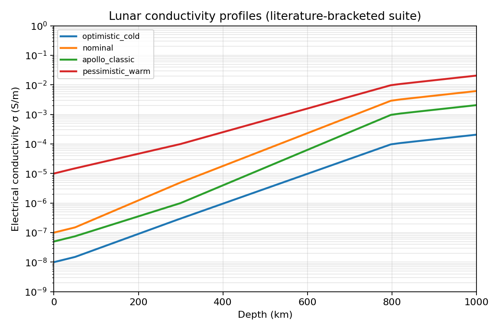

*Literature-bracketed $\sigma(r)$ profiles (optimistic / nominal / Apollo-style / pessimistic) used throughout the campaign.*

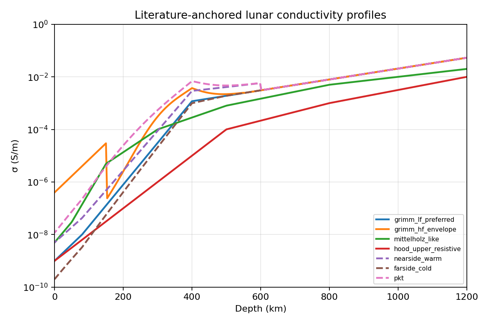

*Grimm (2023) LF preferred fit and related envelopes.*

### Skin Depth & Loss Regime

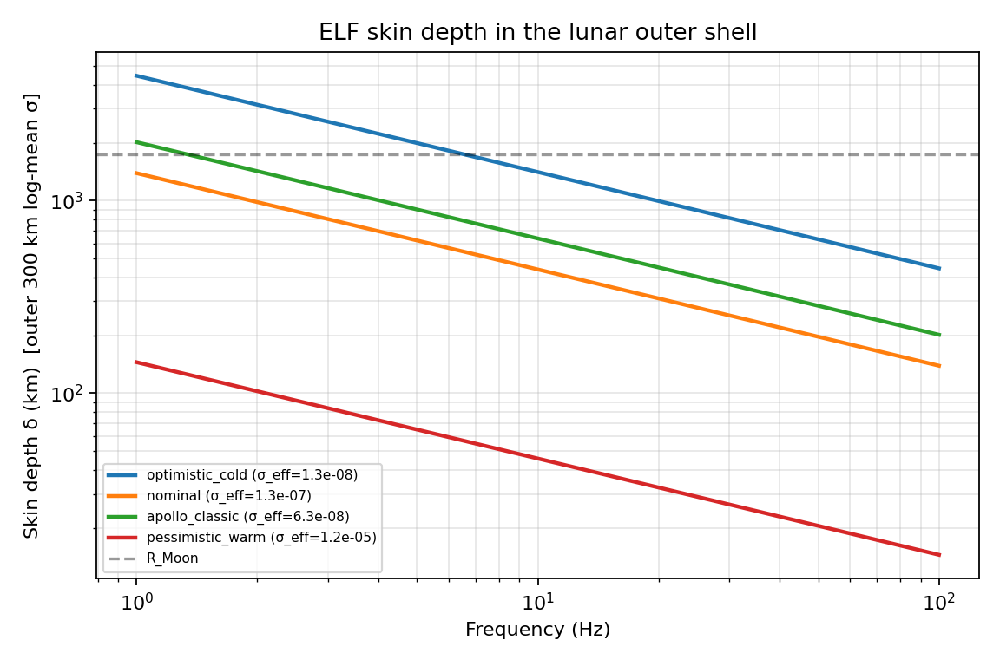

*Electromagnetic skin depth $\delta = \sqrt{2/\omega\mu\sigma}$ across the profile suite.*

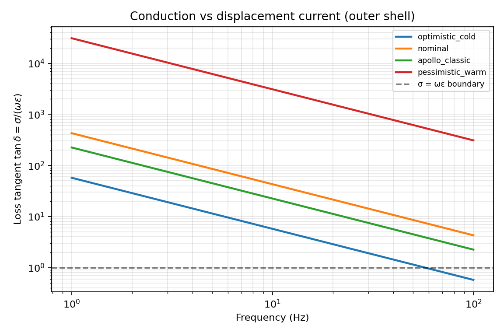

*Loss tangent $\tan\delta = \sigma/(\omega\varepsilon)$. Across the nominal and Apollo-style envelopes at 1–30 Hz, $\tan\delta \gg 1$: conduction current dominates.*

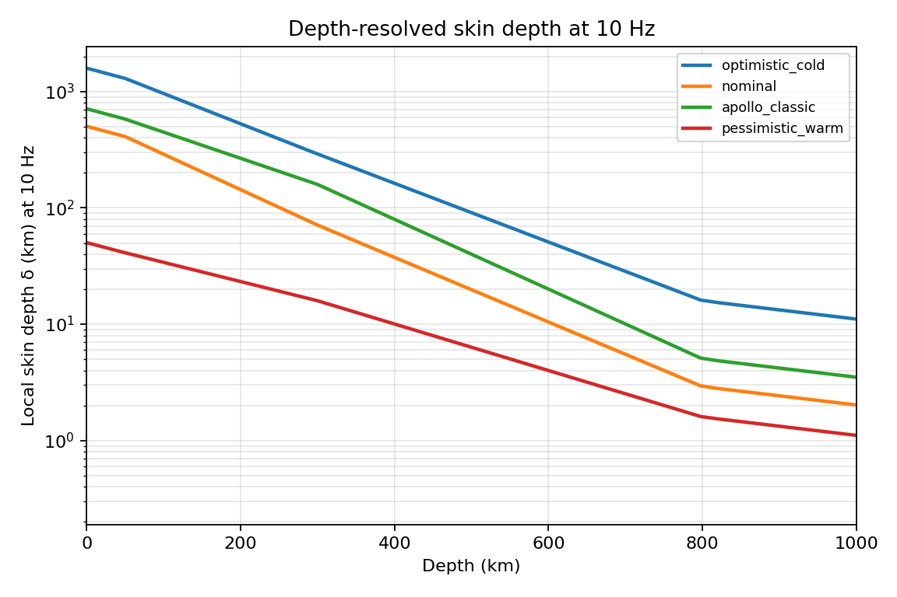

### Path Attenuation

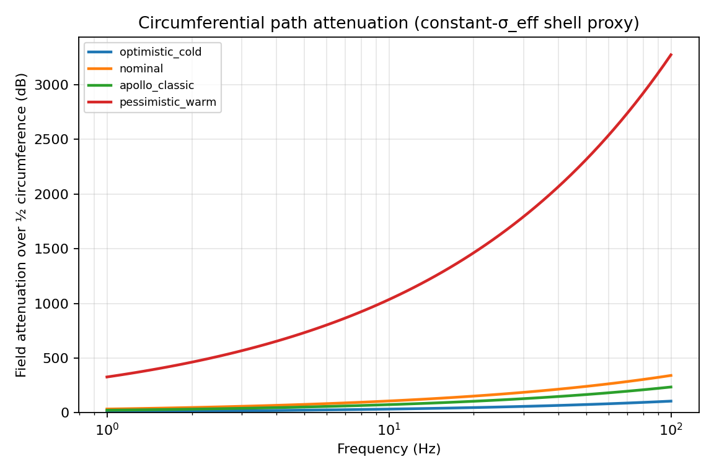

*Half-circumference and full-path attenuation. Nominal profiles produce tens to hundreds of dB of loss — global shell-guided waves are not supported.*

### Cavity Quality Factor

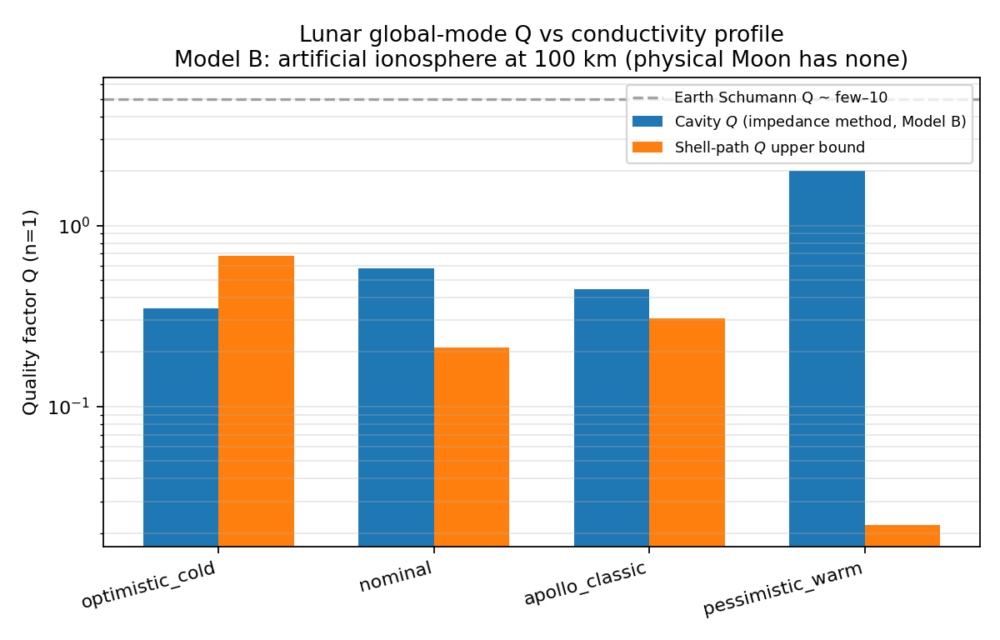

*Model B (artificial 100 km ionosphere) cavity $Q$ for named profiles. Physical Moon (Model A) has no closed cavity ($Q \equiv 0$).*

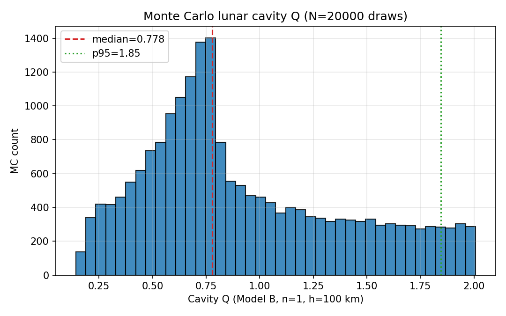

*20 000 literature-bracketed Monte Carlo draws. Median $Q \approx 0.78$; maximum $Q \approx 2.0$; 100% of draws have $Q < 5$.*

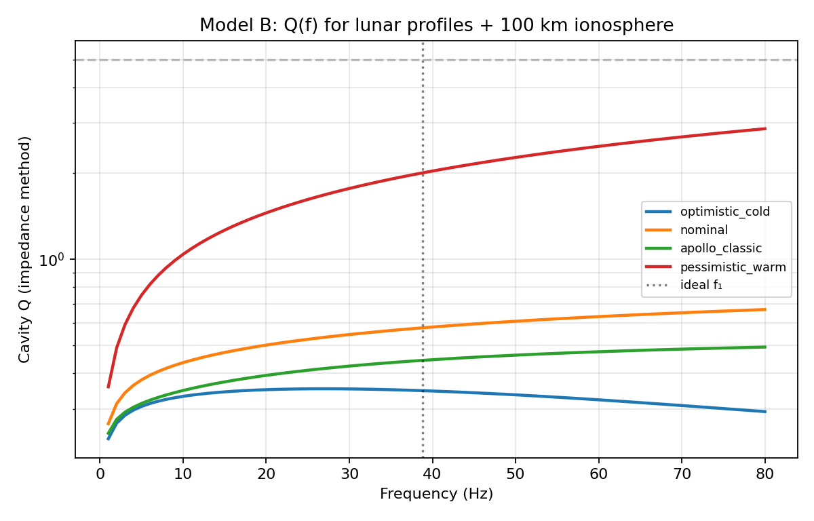

### Surface Impedance & Transfer

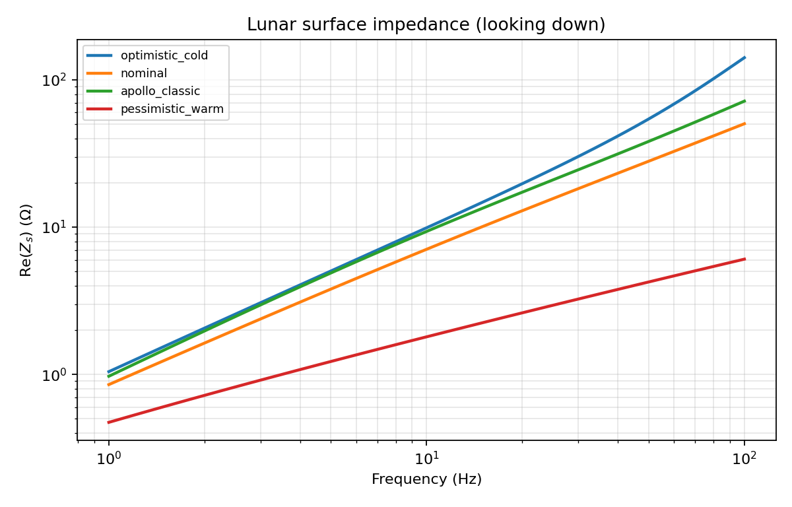

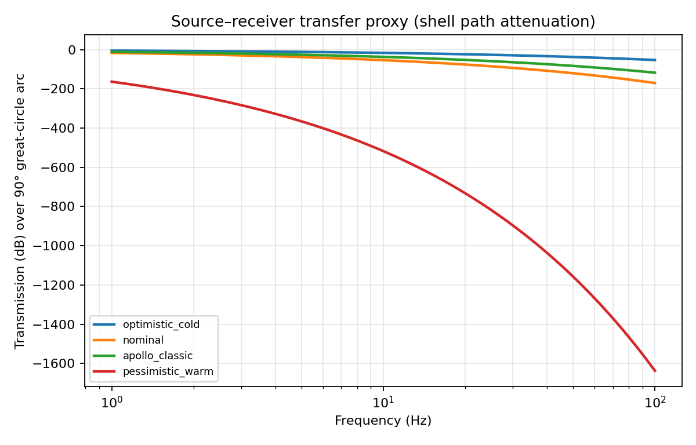

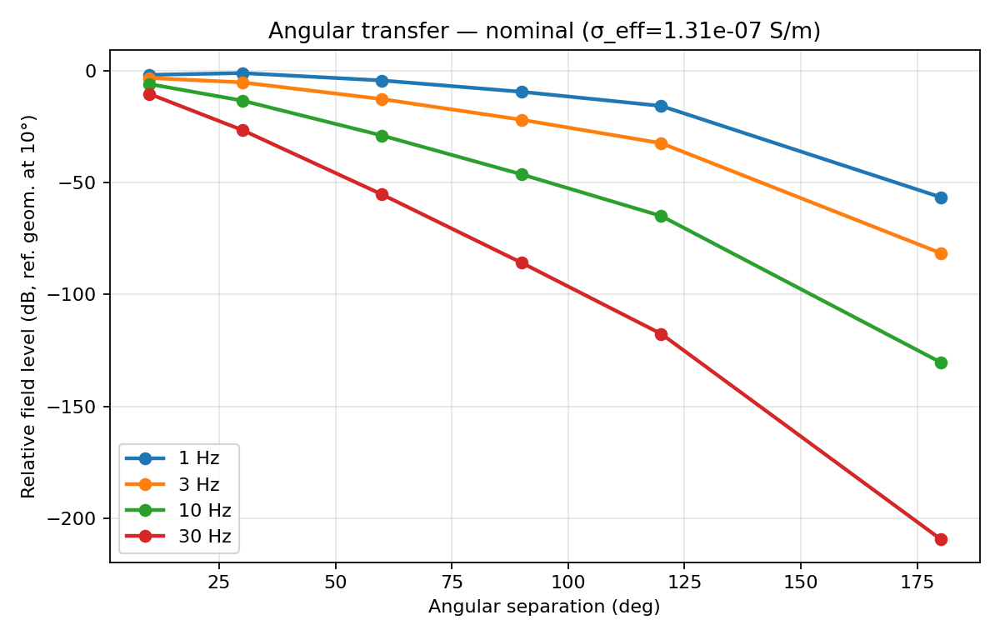

### Lateral / Regional Experiments

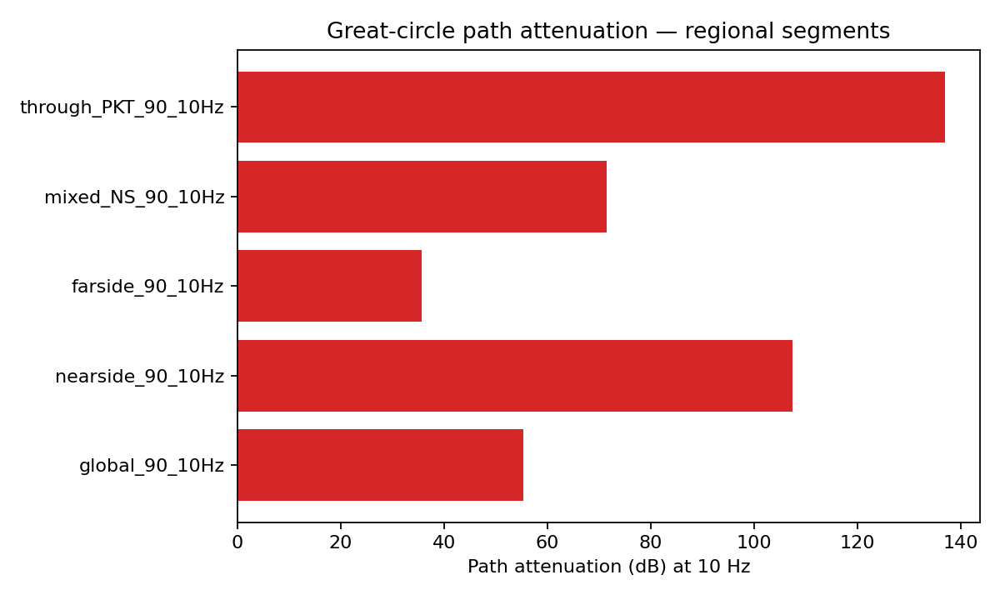

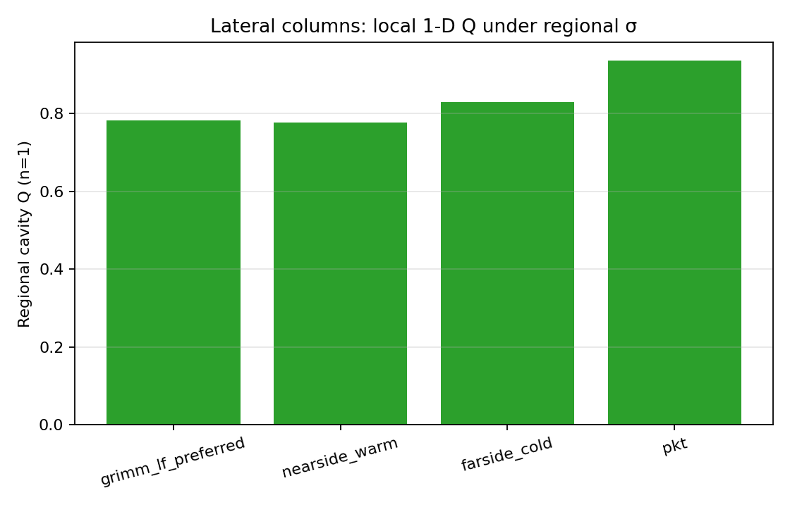

---

## Paper & Reports

- **Rendered PDF**: [`paper/Lunar_Outer_Shell_ELF.pdf`](paper/Lunar_Outer_Shell_ELF.pdf)
- **HTML source**: [`paper/paper.html`](paper/paper.html)
- **Numeric appendices**:
  - [`paper/QUANTITATIVE_RESULTS.md`](paper/QUANTITATIVE_RESULTS.md)
  - [`paper/CAMPAIGN_REPORT.md`](paper/CAMPAIGN_REPORT.md)
  - [`paper/OPTIONAL_REPORT.md`](paper/OPTIONAL_REPORT.md)

---

## Physics Summary

1. **Phase 0** — Outer-shell $\sigma_{\mathrm{eff}}$, skin depth $\delta=\sqrt{2/\omega\mu\sigma}$, loss tangent $\tan\delta=\sigma/(\omega\varepsilon)$, circumferential path attenuation.
2. **Phase 1** — Layered surface impedance looking into $\sigma(r)$:
   - **Model A**: open Moon (no ionosphere) → no closed cavity.
   - **Model B**: artificial ionosphere with
     $$
     Q \approx \frac{\omega\mu_0 h}{2\,\mathrm{Re}(Z_g+Z_i)}
     $$
   - **Model C**: Earth validation smoke test.
3. **Literature profiles** — Grimm (2023) LF fit $\sigma=1.76\times10^{-4}\exp(z_{\mathrm{km}}/210)$ plus Dyal–Parkin lid; Mittelholz-like global envelope; regional nearside/farside/PKT variants.
4. **Monte Carlo** — 20 000 literature-bracketed $\sigma(r)$ draws for $Q$ distributions.
5. **Lateral** — Piecewise great-circle paths and two-hemisphere effective $Q$.

---

## Quick Start

```bash
cd lunar-elf
python scripts/00_build_profiles.py
python scripts/01_skin_maps.py
python scripts/02_cavity_q_sweep.py
python scripts/03_driven_transfer.py
python scripts/04_make_paper_figs.py
python scripts/06_optional_tasks.py   # literature profiles, eigenmodes, lateral
# optional heavy MC:
python scripts/05_heavy_campaign.py --workers 80 --mc 20000
```

Figures land in `paper_figs/`; tables and CSVs in `results/`.

---

## Repository Layout

```
src/lunar_elf/          # core library (profiles, skin, sphere impedance, eigenmodes)
scripts/                # 00–06 analysis pipelines
data/profiles/          # CSV conductivity profiles
data/literature/        # source notes + Grimm arXiv PDF
paper/                  # manuscript + quantitative reports
paper_figs/             # publication-ready figures (PNG)
results/                # phase0 / phase1 / campaign / optional outputs
tests/
```

---

## Citation

If you use the results or code, please cite the accompanying note:

> Perry, N. D. (2026). *The Lunar Outer Shell as a Weakly Conducting, Large–Skin-Depth Medium at Extremely Low Frequencies*. Independent research note. Available in this repository (`paper/Lunar_Outer_Shell_ELF.pdf`).

---

## License

Research code accompanying an independent research note. See repository for terms.
